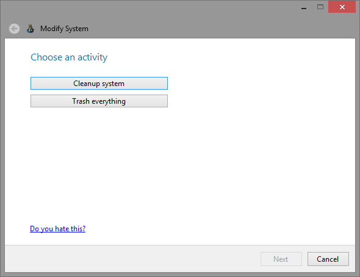
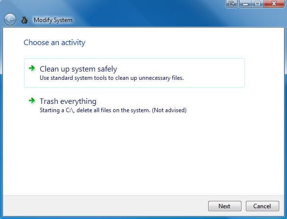
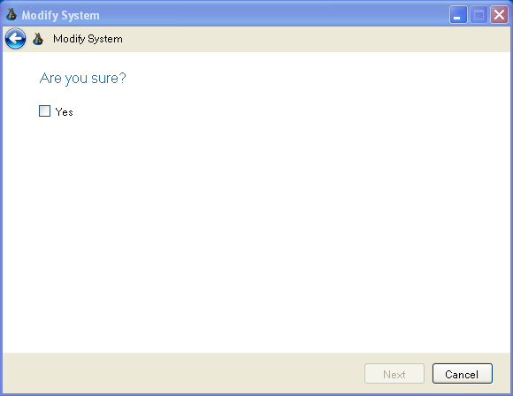

# Wizard .NET Library

> Library for easy creation of custom and Aero Wizards. Aero Wizard strictly follows Microsoft guidelines and uses Visual Styles to get visual theming.

## Online API documentation

Click [here for online documentation for all library elements](https://dahall.github.io/AeroWizard).

## Project Overview

This project provides three main controls:
* **WizardPageContainer** - Allows for easy creation of a custom wizard. It manages page creation at design-time and navigation using user defined buttons.
* **WizardControl** - Builds on the container to provide the full Aero Wizard experience. The wizard visual format pulls from the current system theme. As a result, this wizard will correctly morph on each OS. Under XP, it will provide a old, pre-Aero, look and feel. Under Vista, Win7 and Win8, it will take on the appearance defined by the OS.
* **StepWizardControl** - Extends WizardControl to include a step list that indicates current position through the flow.

The project is built on a number of great projects around the web on creating wizards for .NET using the old Wizard97 format. It also provides a good design-time experience so the developer can focus on the wizard function and not making it work.

## Installation
The control can be downloaded as a VSIX from [this site](https://github.com/dahall/AeroWizard/blob/master/img/AeroWizardTemplates.vsix?raw=true), as the NuGet package [Windows Forms Aero-Wizard Control](https://www.nuget.org/packages/AeroWizard/), from the [Visual Studio Marketplace](https://marketplace.visualstudio.com/items?itemName=dahall.WindowsFormsWizardTemplates), or from within Visual Studio by adding a "New Item" to your Window Forms project, selecting Online, Templates, and searching for "Windows Forms Wizard Templates".

## Sample Code

For sample code, see the [Documentation](https://github.com/dahall/AeroWizard/wiki/Documentation).

## Project Extras

Some other goodies in the source code area are:
* Class that wraps DwmEnableBlurBehindWindow and DwmExtendFrameIntoClientArea capabilities exposed by the Desktop Window Manger (DWM) allow you to create the extended glass window effect. (Native\DWM.cs)
* Entension class for the VisualStyleRenderer class that includes a method to fix the broken GetMargins method and the ability to paint glowing text or paint theme backgrounds on glass. (Native\VisualStylesRendererExtender.cs)
* Controls for a label and button that paint correctly on glass. (ThemedLabel.cs & ThemeImageButton.cs)
* A fully evented generic list. (EventedList.cs)

## Visual Samples
### Design-time Experience

### Custom Example

### Run-time Example - Windows 8

### Run-time Example - Windows 7 / Vista

### Run-time Example - Windows XP (Vista style)

### Run-time Example - Windows XP (Wizard 97 style)

## Release History

See the [Version History](https://github.com/dahall/AeroWizard/wiki/Version-History) page in the Wiki for a full history.

## Meta

Distributed under the MIT license. See [LICENSE](LICENSE.md) for more information.

## Contributing

1. Fork it (<https://github.com/yourname/yourproject/fork>)
2. Create your feature branch (`git checkout -b feature/fooBar`)
3. Commit your changes (`git commit -am 'Add some fooBar'`)
4. Push to the branch (`git push origin feature/fooBar`)
5. Create a new Pull Request
